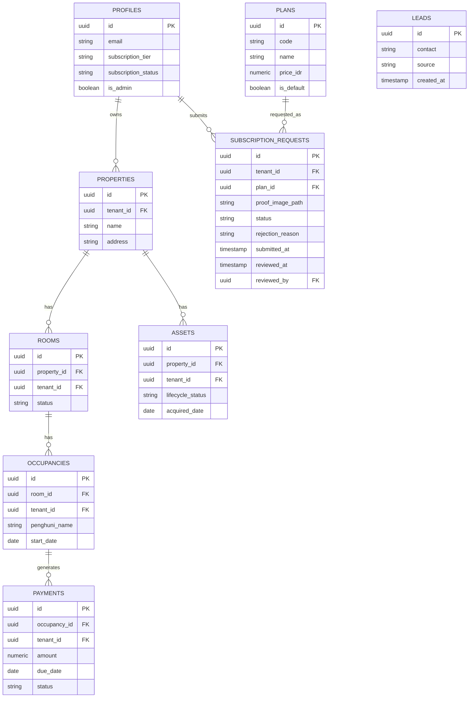

# Architecture — Sistem Manajemen Kos

> Spesifikasi teknis. Untuk spek produk/fitur, lihat `PRD.md`. Untuk arahan visual, lihat `StyleGuide.md`.

## 1. Tech Stack (FIX)

| Layer | Pilihan | Alasan |
|---|---|---|
| Frontend + API | Next.js (App Router) | Satu codebase untuk UI + API routes, cocok solo developer |
| Database | Supabase (Postgres) | Postgres native mendukung Row-Level Security (RLS) untuk multi-tenant |
| Auth | Supabase Auth | Terintegrasi langsung dengan RLS via `auth.uid()` |
| Storage | Supabase Storage | Untuk foto aset/kamar, kalau diperlukan di P1 |
| Hosting | Vercel (Hobby/gratis) | Deploy langsung dari repo Next.js. **Batasan yang harus disadari** (diverifikasi ke docs resmi Vercel, September 2026): cron job Hobby maksimal **1x/hari** (bukan per-jam) dan presisi jadwal ±59 menit — ini justru **cocok** dengan framing "terjadwal/near real-time" di §5, bukan kompromi. Fair-use guidelines Vercel **membatasi Hobby untuk pemakaian non-komersial** — begitu ada pengguna Pro yang benar-benar membayar (bukan lagi tahap portofolio/demo), wajib upgrade ke plan Pro ($20/bulan/seat) sebelum itu terjadi, bukan setelahnya. |
| Scheduled job | Supabase Cron / Vercel Cron | Untuk reminder interval-based (lihat §5) — 1x/hari, lihat batasan Hobby di atas |
| Email notifikasi admin | Resend (atau SMTP provider setara) | **Ditambahkan (FIX, revisi)** — dipakai **hanya** untuk mengirim email notifikasi ke admin saat ada pengajuan verifikasi Pro baru (lihat §3a). Ini **bukan** payment gateway — tidak ada dependensi approval bisnis pihak ketiga, cuma layanan pengiriman email transaksional, risiko rendah. |
| Styling | Tailwind CSS | **Ditambahkan (FIX)** — sebelumnya tidak tercantum di sini walau sudah diasumsikan dipakai di `TASKS.md` 0.1 dan `StyleGuide.md`. Token StyleGuide diimplementasikan sebagai Tailwind config (warna, radius, spacing), bukan CSS-in-JS terpisah. |
| SDK Supabase | `@supabase/supabase-js`, `@supabase/ssr` | **Ditambahkan (FIX)** — SDK resmi Supabase, sudah tercakup begitu Supabase dipilih sebagai backend, bukan dependency tambahan yang perlu izin terpisah. |
| Tooling dev (bukan runtime) | Supabase CLI, Docker (untuk Supabase lokal) | **Ditambahkan (FIX)** — dipakai untuk menjalankan Postgres lokal + menjalankan migration/tes RLS sebelum deploy, bukan bagian dari aplikasi yang di-deploy. Tidak menambah dependency di `package.json` produksi. |

**Keputusan ini final** — hasil diskusi eksplisit, bukan default tanpa pertimbangan. Trade-off yang disadari: porsi "custom backend engineering" yang bisa dipamerkan ke client lebih tipis dibanding Next.js + NestJS/Express terpisah, karena banyak ditangani Supabase. Diterima karena prioritas saat ini adalah kecepatan solo-dev, bukan showcase backend depth.

**Secara eksplisit BUKAN bagian dari tech stack:** payment gateway pihak ketiga (Midtrans, Xendit, atau sejenisnya). Verifikasi pembayaran Pro dilakukan manual oleh admin (lihat §3a) — ini keputusan sadar untuk menghindari dependensi persetujuan pihak ketiga di luar kendali, sesuai PRD.md §8.

**Library lain** (validasi schema seperti zod, UI kit, analytics, test framework) **tidak** di-pre-approve di sini — masing-masing diajukan satu per satu sesuai `workflow.md` §2 saat benar-benar dibutuhkan, bukan diputuskan di muka untuk kebutuhan yang belum konkret.

## 2. Struktur Aplikasi & Landing Page

**Satu repo, satu deploy.** Landing page dan aplikasi inti (dashboard, CRUD) hidup di codebase Next.js yang sama, dipisah lewat route group.

**Struktur root repo (Ditambahkan — sebelumnya dokumen ini hanya menunjukkan subtree `app/`, belum menunjukkan di mana file dokumentasi ini sendiri disimpan):**

```
kos-saas/                          # root repo
├── app/                           # lihat subtree lengkap di bawah
├── lib/
│   └── supabase-admin.ts          # SATU-SATUNYA tempat service role key dipakai — lihat §3a, workflow.md §4
├── supabase/
│   └── migrations/                # migration SQL, urut sesuai TASKS.md
├── public/
│   └── qris-pro.png                # aset QRIS statis (lihat §3a) — gambar tetap, bukan digenerate
├── .claude/
│   ├── rules/
│   │   └── workflow.md            # instruksi operasional — dibaca otomatis tiap sesi
│   └── skills/
│       ├── add-crud-feature/SKILL.md
│       └── verify-rls-isolation/SKILL.md
├── CLAUDE.md                       # dibaca otomatis tiap sesi Claude Code — HARUS di root, case-sensitive
├── PRD.md
├── Architecture.md                 # dokumen ini
├── StyleGuide.md
├── TASKS.md
├── package.json
└── .env.local                      # kunci Supabase (anon + service role), Resend API key — TIDAK di-commit
```

**Kenapa dokumen `.md` ini ditaruh flat di root, bukan di folder `docs/`:** semua cross-reference antar-dokumen di seluruh proyek ini (`PRD.md`, `Architecture.md`, dst.) ditulis sebagai path relatif ke root — memindahkannya ke subfolder berarti mengubah setiap referensi di 6+ file sekaligus tanpa manfaat yang jelas. `CLAUDE.md` sendiri **wajib** di root karena itu yang dibaca Claude Code otomatis tiap sesi — dokumen lain ikut ditaruh di tempat yang sama supaya satu pola konsisten, bukan tersebar.

**Catatan keamanan eksplisit soal `.env.local` dan `lib/supabase-admin.ts`:** service role key adalah kredensial yang bisa membaca/menulis **seluruh data lintas-tenant**, jadi dua hal ini digabung sebagai satu titik pengawasan — kunci hanya boleh dibaca dari `lib/supabase-admin.ts`, file itu hanya boleh diimpor dari kode yang berjalan di server (route admin, Server Action), dan `.env.local` tidak pernah di-commit (`.gitignore` wajib mengecualikannya sejak commit pertama, bukan ditambahkan belakangan setelah keburu ter-commit).

```
app/
├── layout.tsx            # **Ditambahkan (FIX)** — root layout bersama (font, <html>/<body>), wajib ada di
│                          # App Router, sebelumnya tidak dicantumkan di sini. Tidak berisi sidebar/nav apa pun.
├── (marketing)/          # Landing page — publik, tanpa auth
│   ├── layout.tsx        # Layout terpisah dari (app), tanpa sidebar/nav aplikasi
│   └── page.tsx          # Landing page utama
├── (auth)/               # **Ditambahkan (FIX)** — login & register, publik. Sebelumnya tidak ada di §2 sama sekali.
│   ├── layout.tsx        # Kalau sudah ada sesi aktif, redirect ke rute yang sesuai (jangan tampilkan form login lagi)
│   ├── login/
│   └── register/
├── (onboarding)/         # **Ditambahkan (FIX) — gerbang pilih paket, DIPISAH dari (app)**
│   ├── layout.tsx        # HANYA cek sesi (wajib login) — TIDAK cek subscription_tier di sini
│   └── pilih-paket/      # Lihat §3a untuk alasan kenapa ini tidak boleh ada di dalam (app)
├── (app)/                # Aplikasi inti — di belakang auth DAN status paket
│   ├── layout.tsx        # Cek sesi DAN cek `subscription_tier IS NOT NULL` (lihat §3a) — hanya redirect ke
│   │                     # /pilih-paket kalau tier belum dipilih; TIDAK ADA route pilih-paket di dalam grup ini
│   ├── dashboard/
│   ├── properti/
│   ├── kamar/            # **Ditambahkan (FIX)** — sebelumnya tidak ada rute untuk entity `rooms` sama sekali
│   ├── penghuni/
│   ├── pembayaran/
│   └── aset/
├── admin/                # **Ditambahkan (FIX, revisi)** — panel verifikasi langganan, TERPISAH dari (app)
│   ├── layout.tsx        # Cek `profiles.is_admin`, bukan tenant biasa — lihat §3a
│   └── verifikasi/       # List pengajuan Pro pending + approve/reject
└── api/                  # API routes (dipakai (app)/admin, bukan (marketing))
```

**Kenapa `/pilih-paket` punya route group sendiri, bukan di dalam `(app)/` (Diperbaiki — bug nyata di versi sebelumnya):** kalau `/pilih-paket` ada di dalam `(app)/`, dan layout `(app)` me-redirect setiap user bertier `NULL` ke `/pilih-paket`, maka mengunjungi `/pilih-paket` itu sendiri juga memicu layout yang sama — hasilnya **redirect loop tanpa henti**. `(onboarding)` dipisah persis supaya layout-nya hanya mensyaratkan sesi, tidak pernah mensyaratkan tier, sehingga tidak pernah me-redirect dirinya sendiri.

**Kenapa `admin/` bukan sub-route di dalam `(app)/`:** admin bukan tenant — perannya melihat data lintas-tenant (semua pengajuan langganan), bukan data miliknya sendiri. Menaruhnya di dalam `(app)/` berisiko admin "tercampur" dengan logic tenant-scoped yang ada di sana. Dipisah sebagai top-level route dengan guard sendiri (`profiles.is_admin`).

**Kenapa satu repo, bukan dipisah:** solo developer dengan satu produk portofolio — dua repo/deploy pipeline untuk satu produk adalah overhead operasional tanpa manfaat sepadan di skala ini. Route group `(marketing)` vs `(app)` sudah cukup memisahkan concern tanpa split infrastruktur.

**Ketergantungan landing page ke backend:** minimal. Landing page hanya butuh satu tabel `leads` (lihat §4) untuk menangkap CTA "daftar minat" — **tidak** butuh skema multi-tenant, auth, atau RLS untuk bisa dibangun dan di-deploy. Ini yang membuat landing page bisa dibangun **sebelum** fondasi aplikasi tanpa menciptakan dependency terbalik.

## 3. Multi-Tenancy: Row-Level Security (FIX)

**Pendekatan:** row-level dengan kolom `tenant_id` di setiap tabel milik-tenant, ditegakkan lewat Postgres RLS — **bukan** filter manual `WHERE tenant_id = ?` di level query aplikasi.

**Kenapa RLS, bukan filter manual:**
- Filter manual rawan human error — satu query yang lupa filter = kebocoran data antar-tenant.
- RLS ditegakkan di level database, jadi tetap aman meski ada bug di application layer.
- Ini defensible secara teknis kalau ditanya reviewer/client soal keamanan data multi-tenant.

**Definisi `tenant_id` (Diperbaiki — sebelumnya tidak pernah didefinisikan eksplisit, tipe juga tidak konsisten):**

**[FIX]** Untuk v1, **satu akun owner = satu tenant** — tidak ada tabel `tenants` terpisah, dan tidak ada konsep multi-user per tenant (mengundang staf/karyawan sebagai akun tambahan dalam satu tenant yang sama ada di luar scope v1). Karena itu, `tenant_id` di setiap tabel milik-tenant **mereferensikan `profiles.id` secara langsung** (yang juga sama dengan `auth.users.id`) — bukan mereferensikan sebuah tabel `tenants` yang berdiri sendiri. Tipenya **`uuid` di semua tabel, tanpa kecuali** — versi sebelumnya salah menuliskan beberapa sebagai `string`, itu bukan keputusan sengaja, hanya kelalaian penulisan ERD.

**Pola RLS (contoh untuk tabel `rooms`):**

```sql
alter table rooms enable row level security;

create policy "tenant_isolation" on rooms
  using (tenant_id = (select id from profiles where id = auth.uid()));
```

Setiap tabel milik-tenant (`properties`, `rooms`, `occupancies`, `payments`, `assets`, `subscription_requests`) mengikuti pola yang sama. **Catatan penamaan:** entity penghuni bernama `occupancies` di ERD §4 dan `TASKS.md` — sebutan "`tenants_penghuni`" yang sempat muncul di draf awal dokumen ini adalah sisa penulisan yang tidak konsisten, bukan nama tabel yang benar. Gunakan `occupancies`.

**Skala prioritas:** MVP fokus ke owner satu-properti, tapi skema `tenant_id` + `property_id` sudah mendukung multi-properti sejak baris pertama — tidak ada migrasi skema besar yang diperlukan kalau nanti owner multi-properti onboard. **Kalau nanti v2 butuh multi-user per tenant** (staf dengan akun login sendiri di bawah satu owner), itu akan butuh tabel `tenants` terpisah dan migrasi `tenant_id` di semua tabel — didesain ulang saat itu terjadi, bukan diantisipasi sekarang.

**Perlindungan kolom sensitif di `profiles` (Ditambahkan — celah privilege-escalation nyata yang sebelumnya tidak disebutkan):** RLS baris (row-level) mengontrol *baris mana* yang boleh diakses, tapi **tidak mencegah user mengubah kolom apa pun di barisnya sendiri** kalau ada UPDATE policy yang mengizinkannya. Kalau `profiles` punya UPDATE policy standar "user boleh update baris miliknya sendiri", user itu bisa saja mengirim request `UPDATE profiles SET subscription_tier='pro', is_admin=true WHERE id=auth.uid()` lewat DevTools/API langsung — RLS baris tidak menghalangi ini karena barisnya memang miliknya.

**Wajib:** UPDATE policy untuk role `authenticated` di tabel `profiles` **tidak boleh** memberi akses tulis ke kolom `subscription_tier`, `subscription_status`, `is_admin`, atau `tenant_id`/`id` — ditegakkan lewat **column-level privilege** Postgres (bukan cuma row policy), misalnya:

```sql
revoke update on profiles from authenticated;
grant update (full_name) on profiles to authenticated; -- hanya kolom yang memang boleh diubah user sendiri
```

Kolom-kolom sensitif itu hanya boleh berubah lewat: trigger saat signup (nilai default), atau Postgres function dengan service role (`approve_subscription_request`, dst. — lihat §3a). Ini bukan detail kecil — tanpa ini, seluruh mekanisme gerbang paket & admin di §3a bisa dilewati dengan satu request langsung ke API Supabase.

## 3a. Gerbang Wajib Pilih Paket & Verifikasi Admin (FIX, revisi)

**Alur produk lengkap ada di `PRD.md` §5a — bagian ini fokus ke penegakan teknisnya.**

**Penegakan gerbang, dipecah ke dua layout terpisah (Diperbaiki — versi sebelumnya menaruh gerbang dan tujuannya di layout yang sama, menyebabkan redirect loop; lihat §2):**

`(onboarding)/layout.tsx` (isi `/pilih-paket`):
1. Cek sesi saja. Kalau tidak ada sesi → redirect ke `/login`. **Tidak ada pengecekan `subscription_tier` di sini** — ini justru tempat tier itu ditentukan, jadi tidak boleh mensyaratkan dirinya sendiri.

`(app)/layout.tsx` (dashboard dan seterusnya):
1. Cek sesi. Kalau tidak ada sesi → redirect ke `/login`.
2. Cek `profiles.subscription_tier`. Kalau `NULL` (belum pernah memilih paket) → redirect ke `/pilih-paket` (yang ada di grup `(onboarding)`, bukan di sini — tidak ada loop). Tidak ada cara melewati ini dari sisi client — ini harus dicek server-side di layout/middleware, bukan cuma disembunyikan di UI (pola yang sama dengan prinsip feature gating di §6).
3. Kalau `subscription_tier` sudah terisi (`'free'` atau `'pro'`) → lanjut ke rute yang diminta, dengan fitur dibatasi sesuai §6.

**Alur data saat submit pengajuan Pro:**
1. User pilih "Pro" di `/pilih-paket` → tampilkan QRIS statis (aset gambar tetap di `public/qris-pro.png`, bukan digenerate per-transaksi) + nominal yang harus ditransfer (lihat `plans.price_idr`, PRD.md §5b).
2. **Urutan penting (Diperbaiki — versi sebelumnya punya masalah ayam-telur):** id pengajuan (`request_id`, sebuah UUID) **dibuat di client/server terlebih dahulu** (`crypto.randomUUID()`) SEBELUM upload, supaya path file di Storage (`{tenant_id}/{request_id}.{ext}`) sudah pasti sebelum baris `subscription_requests` diinsert. Urutannya: (a) generate `request_id`, (b) upload file ke path itu, (c) insert row `subscription_requests` dengan `id = request_id` yang sama (bukan dibiarkan auto-generate) dan `proof_image_path` (bukan `proof_image_url` — lihat §4, ini path objek di bucket privat, bukan URL publik yang stabil) diisi path dari langkah (b), (d) **set `profiles.subscription_tier = 'free'` dan `profiles.subscription_status = 'pending_verification'`** (bukan `NULL` lagi, supaya lolos gate di atas dan tetap bisa pakai dashboard dengan batasan Free selama menunggu).
3. **Boleh disubmit ulang** kalau pengajuan sebelumnya ditolak (`PRD.md` §5a) — insert row baru (dengan `request_id` baru), riwayat lama tidak dihapus/ditimpa.
4. Trigger (Supabase Edge Function atau API route setelah insert) mengirim email ke admin via Resend — isi ringkas: siapa, paket apa, link untuk membuka bukti transfer (link ini mengarah ke endpoint admin yang membuat *signed URL* sementara lewat service role, bukan URL publik langsung ke bucket privat).
5. Admin buka `/admin/verifikasi`, review, approve/reject.

**Kenapa endpoint admin TIDAK memakai pola RLS "admin melihat semua" seperti tenant biasa:** menulis RLS policy yang membuat satu role bisa melihat/mengubah data **lintas seluruh tenant** adalah permukaan risiko yang jauh lebih besar daripada isolasi RLS biasa — sekali salah tulis, bisa berarti kebocoran data semua tenant, bukan cuma satu. Pendekatan yang lebih aman dan lebih mudah diverifikasi: operasi admin (approve/reject) berjalan lewat **API route/Server Action yang dijalankan di server**, memakai **Supabase service role key** (yang secara desain bypass RLS) — **dan service role key ini tidak pernah boleh dikirim/diekspos ke client**. Guard aksesnya cukup satu pemeriksaan sederhana: request harus datang dari user yang `profiles.is_admin = true`, dicek di server sebelum service role key dipakai.

**Approve/reject harus atomik, bukan dua update terpisah dari kode aplikasi (Ditambahkan):** approve mengubah **dua tabel sekaligus** (`subscription_requests.status` dan `profiles.subscription_tier`/`subscription_status`). Kalau ditulis sebagai dua panggilan `update` terpisah dari API route, ada window di mana satu berhasil dan satu gagal (network error, dsb) — hasilnya data tidak konsisten (misal request sudah `approved` tapi tier belum berubah). Ini harus jadi **satu Postgres function** (`approve_subscription_request(request_id, admin_id)` / `reject_subscription_request(...)`), dipanggil lewat RPC dengan service role, supaya kedua perubahan terjadi dalam satu transaction database — bukan dua langkah terpisah yang bisa gagal di tengah.

**Bootstrapping admin pertama (Ditambahkan — gap yang sebelumnya tidak disebutkan):** tidak ada UI untuk membuat admin pertama — kalau semua akun baru `is_admin default false`, tidak ada cara dari dalam aplikasi untuk mempromosikan siapa pun jadi admin (masalah ayam-telur). Solusinya: **langkah manual satu kali** lewat Supabase Studio (SQL editor), `update profiles set is_admin = true where email = '<email pemilik produk>'`, dilakukan sekali di awal sebelum panel admin pernah diuji. Ini bukan bug yang perlu "diperbaiki" dengan fitur invite-admin — untuk skala solo-developer/portofolio, satu langkah manual sekali di awal itu wajar; kalau nanti butuh banyak admin, baru itu jadi fitur tersendiri (di luar scope v1).

**Privasi bucket `bukti-transfer` (Ditambahkan):** ini bukti transfer bank — **bukan** aset publik seperti foto kamar. Bucket harus **private** (bukan `public: true`), dengan storage policy: tenant hanya boleh baca/tulis object di path miliknya sendiri (`{tenant_id}/...`), dan akses admin lewat service role (yang bypass storage RLS juga, konsisten dengan pola §3a). **Validasi upload** (dicek di client dan ditegakkan di level bucket): tipe file dibatasi `image/png`/`image/jpeg` saja, ukuran maksimum wajar (misal 5MB) — bukan sekadar validasi kosmetik di form, karena upload file adalah permukaan yang mudah disalahgunakan kalau tidak dibatasi.

**Kolom baru di `profiles` (lihat §4):** `is_admin boolean default false`, `subscription_status text` (`'active'` | `'pending_verification'`).

**[HIPOTESIS — belum diputuskan]** Status Pro tidak auto-expire di v1 (lihat PRD.md §5a poin 7) — tidak ada job terjadwal yang mengecek "masa aktif habis". Kalau nanti butuh model berlangganan berulang, ini butuh tabel/kolom tambahan (`valid_until`, job cron pengecekan) yang belum didesain di sini.

**[RISIKO DITERIMA]** Verifikasi manual berbasis screenshot tidak bisa memastikan keaslian transaksi secara otomatis (lihat `PRD.md` §9) — admin mengecek "masuk akal" secara visual, bukan validasi kriptografis terhadap data bank riil. Konsekuensi sadar dari memilih model manual, bukan celah teknis yang perlu ditambal di v1.

## 4. Data Model (Overview)



**Catatan tipe (Diperbaiki):** `tenant_id` di semua tabel di atas bertipe `uuid` dan mereferensikan `profiles.id` langsung (lihat §3 — satu owner = satu tenant di v1, tidak ada tabel `tenants` terpisah). Versi sebelumnya menuliskan sebagian sebagai `string` — itu bukan keputusan, hanya kelalaian penulisan, sudah diperbaiki di sini.

**Catatan tambahan (Diperbaiki — inkonsistensi baru ditemukan):** `PROFILES` **tidak** punya kolom `tenant_id` sendiri — versi ERD sebelumnya keliru mencantumkannya. Karena `profiles.id` **adalah** tenant identifier itu sendiri (lihat §3), menambahkan kolom `tenant_id` terpisah di `PROFILES` yang menunjuk ke dirinya sendiri hanya menciptakan dua sumber kebenaran yang bisa saling drift — cukup pakai `profiles.id` langsung di mana pun `tenant_id` owner dibutuhkan. Kolom `tenant_id` **hanya** ada di tabel lain yang **dimiliki** tenant (`properties`, `rooms`, `occupancies`, `payments`, `assets`, `subscription_requests`), bukan di `profiles` sendiri.

Catatan: `LEADS` sengaja **tidak** punya `tenant_id` — tabel ini milik landing page (pre-auth), bukan bagian skema aplikasi tenant. **Tapi tetap wajib RLS aktif (Diperbaiki — celah nyata di versi sebelumnya):** anon key Supabase bersifat publik (tertanam di kode client), jadi tabel tanpa RLS bisa dibaca/ditulis siapa pun yang tahu anon key. Policy untuk `leads`: **hanya `INSERT` untuk role `anon`/`authenticated`, tidak ada `SELECT`** — Anda membaca isinya lewat Supabase Studio (yang pakai koneksi terpisah, bukan lewat REST API dengan anon key), bukan lewat endpoint publik.

Catatan tambahan: `SUBSCRIPTION_REQUESTS` punya `tenant_id`, dan tenant biasa **hanya** boleh melihat pengajuannya sendiri (RLS isolasi standar seperti tabel lain — wajib diverifikasi lewat skill `verify-rls-isolation` seperti biasa). Yang **tidak** memakai RLS "lihat semua" adalah **akses admin** ke tabel ini — itu ditegakkan lewat service role key di server, bukan lewat policy RLS tambahan (lihat §3a untuk alasannya). `rejection_reason` (nullable) diisi saat admin reject, sesuai `PRD.md` §5a.

`PLANS` adalah tabel referensi kecil (2 baris: `free`, `pro`) — **RLS tetap aktif** (Diperbaiki, sama alasannya dengan `leads`): policy **hanya `SELECT`** untuk `anon`/`authenticated` (dibaca publik di halaman `/pilih-paket`, termasuk sebelum login kalau harga ditampilkan di landing page), **tidak ada `INSERT`/`UPDATE`/`DELETE`** untuk role itu — harga hanya diubah lewat migration/Supabase Studio, bukan lewat API.

ERD detail per kolom (tipe lengkap, constraint, index) disusun terpisah saat implementasi masing-masing fitur — dokumen ini memberi kerangka, bukan DDL final.

## 5. Reminder & Scheduled Job (P1)

**Mekanisme:** scheduled job berbasis interval (cron), **bukan** real-time/push notification. Job berjalan **1x/hari** (bukan per-jam — lihat batasan Vercel Hobby di §1), mengecek `payments.due_date` dan `assets` yang butuh servis, lalu menandai status atau mengirim notifikasi (in-app / email).

**Penerima reminder (Ditambahkan — sebelumnya tidak disebutkan):** **owner** (email terdaftar di `profiles`), **bukan penghuni**. Penghuni (`occupancies.penghuni_name`) bukan pengguna sistem ini sama sekali — tidak ada login/akun untuk mereka di v1, jadi tidak ada jalur untuk mengirim reminder ke mereka.

**Framing wajib di semua dokumen dan UI:** gunakan istilah **"terjadwal"** atau **"near real-time"** — jangan pernah "real-time", karena itu overclaim terhadap arsitektur interval-based yang sebenarnya. Interval 1x/hari (bukan pilihan, melainkan batasan platform Hobby) justru memperkuat framing ini, bukan melemahkannya.

## 6. Feature Gating (Tier Langganan — **P0** sejak revisi ini, bukan P1)

**[FIX, direvisi]** Karena gerbang paket sekarang wajib sebelum dashboard (§3a), gating bukan lagi penyempurnaan P1 — sebagian harus sudah aktif sejak dashboard pertama kali dibuka. Kerangka gating mengikuti matriks fitur di `PRD.md` §5b: **kombinasi** batasan kuota (untuk fitur inti) dan penguncian modul total (untuk fitur P1). Kedua pola harus dicek di level data/API, bukan cuma disembunyikan di UI.

**Peringatan penting soal cara menulis policy gating (Diperbaiki — bug keamanan nyata di versi sebelumnya):** Postgres menggabungkan beberapa policy **PERMISSIVE** (default) dengan **OR**, bukan AND. Contoh sebelumnya di dokumen ini menulis `pro_only_assets` sebagai policy permissive terpisah dari `tenant_isolation` — akibatnya, kalau digabung, seorang user Pro (tenant mana pun) **lolos policy itu berdasarkan `OR`**, sehingga secara tidak sengaja bisa melihat aset **semua tenant**, bukan cuma miliknya. Ini kebocoran data lintas-tenant, bukan cuma bug kecil. Perbaikannya: policy gating fitur **wajib ditulis sebagai `AS RESTRICTIVE`**, yang digabung dengan **AND** terhadap hasil semua policy permissive (termasuk `tenant_isolation` di §3) — jadi baris hanya terlihat kalau **tenant cocok DAN syarat tier terpenuhi**, bukan salah satu saja.

**Pola 1 — batasan kuota** (properti, kamar):

```sql
-- policy dasar tenant_isolation (permissive, §3) tetap ada di tabel ini dan tetap berlaku untuk INSERT
-- policy tambahan di bawah ini RESTRICTIVE — jadi meng-AND-kan syarat kuota, bukan menggantikan isolasi tenant
create policy "free_tier_property_limit" on properties
  as restrictive
  for insert
  with check (
    (select subscription_tier from profiles where id = auth.uid()) = 'pro'
    or (
      select count(*) from properties
      where tenant_id = (select id from profiles where id = auth.uid())
    ) < 1
  );

-- pola sama untuk rooms, ganti angka batas & tabel yang dicek — subquery count() WAJIB difilter
-- ke tenant_id milik user sendiri seperti di atas, bukan menghitung seluruh tabel lintas-tenant
```

**Pola 2 — modul terkunci total** (Asset & Maintenance Management, reminder otomatis):

```sql
-- policy dasar tenant_isolation (permissive, §3) tetap ada di tabel assets
-- policy ini RESTRICTIVE — hasil akhirnya: tenant cocok DAN tier pro, bukan tenant cocok ATAU tier pro
create policy "pro_only_assets" on assets
  as restrictive
  for all
  using (
    (select subscription_tier from profiles where id = auth.uid()) = 'pro'
  );
```

Kalau gating hanya di UI (tombol/menu disembunyikan tapi API tetap terima request), sistem tidak bisa disebut kredibel sebagai SaaS freemium — user teknis akan mengecek ini lewat DevTools/API call langsung. **Setiap policy gating baru yang ditambahkan HARUS dites eksplisit untuk dua arah:** (a) user Pro tenant A tidak bisa melihat data tenant B meski sama-sama Pro, (b) user Free tenant A benar-benar terblokir dari modul Pro-only. Bug OR di atas baru ketahuan karena diperiksa dari sudut (a) — skill `verify-rls-isolation` perlu diperluas mencakup uji silang tier x tenant ini, bukan cuma tenant x tenant. **Catatan:** angka kuota spesifik (1 properti, 5 kamar) adalah placeholder dari `PRD.md` §5b — dikonfigurasi sebagai nilai yang mudah diubah (bukan hardcode berulang di banyak query), karena angka ini eksplisit ditandai `[HIPOTESIS]` dan kemungkinan berubah.

## 7. Non-Goals Teknis (selaras PRD §8)

- Tidak ada arsitektur microservices — satu aplikasi monolith Next.js.
- Tidak ada message queue/event streaming — skala ini tidak membutuhkannya.
- Tidak ada infrastruktur multi-region — single region Supabase/Vercel cukup.
- Tidak ada integrasi payment gateway pihak ketiga (lihat §1 dan §3a) — verifikasi pembayaran manual.
- Service role key Supabase **tidak pernah** dipakai di kode yang berjalan di client, dan **tidak** dipakai untuk operasi tenant biasa manapun (CRUD kamar/penghuni/pembayaran/aset tetap lewat RLS seperti biasa) — hanya untuk operasi admin lintas-tenant yang eksplisit didefinisikan di §3a.

## 8. Referensi Terkait

- `PRD.md` — spek produk, fitur, target user.
- `StyleGuide.md` — arahan visual.
- `TASKS.md` — roadmap build, dimulai dari Landing Page.
