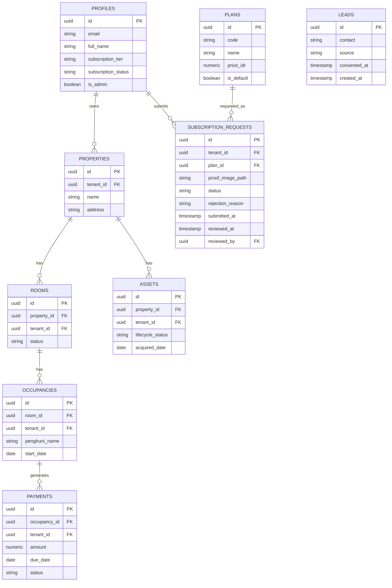

# Architecture — Sistem Manajemen Kos

> Spesifikasi teknis. Untuk spek produk/fitur, lihat `docs/PRD.md`. Untuk arahan visual, lihat `docs/StyleGuide.md`.

## 1. Tech Stack (FIX)

| Layer | Pilihan | Alasan |
|---|---|---|
| Frontend + API | Next.js (App Router) | Satu codebase untuk UI + API routes, cocok solo developer |
| Database | Supabase (Postgres) | Postgres native mendukung Row-Level Security (RLS) untuk multi-tenant |
| Auth | Supabase Auth | Terintegrasi langsung dengan RLS via `auth.uid()` |
| Storage | Supabase Storage | Untuk foto aset/kamar, kalau diperlukan di P1 |
| Hosting | Vercel (Hobby/gratis) | Deploy langsung dari repo Next.js. **Batasan yang harus disadari** (diverifikasi ke docs resmi Vercel, September 2026): cron job Hobby maksimal **1x/hari** (bukan per-jam) dan presisi jadwal ±59 menit — ini justru **cocok** dengan framing "terjadwal/near real-time" di §5, bukan kompromi. Fair-use guidelines Vercel **membatasi Hobby untuk pemakaian non-komersial** — begitu ada pengguna Pro yang benar-benar membayar (bukan lagi tahap portofolio/demo), wajib upgrade ke plan Pro ($20/bulan/seat) sebelum itu terjadi, bukan setelahnya. |
| Scheduled job | Supabase Cron / Vercel Cron | Untuk reminder interval-based (lihat §5) — 1x/hari, lihat batasan Hobby di atas |
| Email notifikasi admin | Resend (atau SMTP provider setara) | **Ditambahkan (FIX, revisi)** — dipakai **hanya** untuk mengirim email notifikasi ke admin saat ada pengajuan verifikasi Pro baru (lihat §3a). Ini **bukan** payment gateway — tidak ada dependensi approval bisnis pihak ketiga, cuma layanan pengiriman email transaksional, risiko rendah. |
| Styling | Tailwind CSS **v4** | **Ditambahkan (FIX), diperjelas setelah scaffold nyata di task 0.1** — Tailwind v4 **tidak** memakai `tailwind.config.js`; token StyleGuide diimplementasikan di `app/globals.css`: blok `@theme` (statis), variabel warna per tema di `:root`/`[data-theme="dark"]`, dan `@theme inline` yang memetakannya ke utility — lihat §1a (diperbarui di task 0.1a; sebelumnya cuma blok `@theme`). Jangan cari/asumsikan ada `tailwind.config.js` di repo ini — itu bukan file yang hilang, memang tidak ada di v4. |
| SDK Supabase | `@supabase/supabase-js`, `@supabase/ssr` | **Ditambahkan (FIX)** — SDK resmi Supabase, sudah tercakup begitu Supabase dipilih sebagai backend, bukan dependency tambahan yang perlu izin terpisah. |
| Tooling dev (bukan runtime) | Supabase CLI, Docker (untuk Supabase lokal) | **Ditambahkan (FIX)** — dipakai untuk menjalankan Postgres lokal + menjalankan migration/tes RLS sebelum deploy, bukan bagian dari aplikasi yang di-deploy. Tidak menambah dependency di `package.json` produksi. |
| Font | Inter (via `next/font`) | **Ditambahkan (FIX, ronde 6)** — dari paket desain final (`docs/StyleGuide.md` §3), bobot 400/500/600 di `app/layout.tsx`. Bukan dependency baru yang perlu izin: `next/font` sudah bagian dari Next.js, bukan library tambahan. |

**Keputusan ini final** — hasil diskusi eksplisit, bukan default tanpa pertimbangan. Trade-off yang disadari: porsi "custom backend engineering" yang bisa dipamerkan ke client lebih tipis dibanding Next.js + NestJS/Express terpisah, karena banyak ditangani Supabase. Diterima karena prioritas saat ini adalah kecepatan solo-dev, bukan showcase backend depth.

**Secara eksplisit BUKAN bagian dari tech stack:** payment gateway pihak ketiga (Midtrans, Xendit, atau sejenisnya). Verifikasi pembayaran Pro dilakukan manual oleh admin (lihat §3a) — ini keputusan sadar untuk menghindari dependensi persetujuan pihak ketiga di luar kendali, sesuai docs/PRD.md §8.

**Library lain** (validasi schema seperti zod, UI kit, analytics, test framework) **tidak** di-pre-approve di sini — masing-masing diajukan satu per satu sesuai `.claude/rules/workflow.md` §2 saat benar-benar dibutuhkan, bukan diputuskan di muka untuk kebutuhan yang belum konkret.

## 1a. Implementasi Tema Gelap (Ditambahkan, ronde 6; diimplementasikan di task 0.1a)

Token lengkap (nilai hex per tema) ada di `docs/StyleGuide.md` §2/§3a — bagian ini hanya mekanisme teknisnya, mengikuti pola yang sudah diverifikasi di paket desain final (`docs/design/04-tema-gelap.md`).

**Berkas yang mengimplementasikannya:** `app/globals.css` (token, `@custom-variant dark`, `@theme inline`), `app/layout.tsx` (skrip tema di `<head>`, font Inter), `lib/theme-script.ts` (skrip + `applyTheme`/`readThemePref`/`subscribeThemePref`), `components/theme/ThemeSwitcher.tsx`, `components/brand/Logo.tsx`, `components/brand/ThemedImage.tsx`. Penyimpangan dari kode paket desain, dan alasannya, dicatat di `docs/design/README.md`.

**Mekanisme (bukan library seperti `next-themes` — zero dependency, sesuai §1 "library lain diajukan satu per satu saat dibutuhkan"):**

1. Skrip inline sinkron di `<head>` (lewat `dangerouslySetInnerHTML`, **bukan** `<Script>` Next.js yang async) membaca `localStorage['mk-theme']` (`'light'` | `'dark'` | `'system'`, default `'system'`) dan menulis atribut `data-theme` ke `<html>` **sebelum** paint — mencegah kedipan tema salah. `<html>` wajib `suppressHydrationWarning` karena atribut ini beda dari yang di-render server. **Diverifikasi (5 Okt 2026):** pada saat `<body>` pertama kali ada, `data-theme` sudah benar (pilihan `light` tersimpan di OS gelap → `light`; `system` di OS gelap → `dark`), dan console dev tidak memunculkan peringatan React 19 soal tag `<script>`.
2. `app/globals.css`: `@custom-variant dark (&:where([data-theme=dark], [data-theme=dark] *));` lalu token didefinisikan di `:root` (terang) dan `[data-theme="dark"]` (gelap), dipetakan ke utility Tailwind lewat `@theme inline`.
3. Preferensi disimpan di `localStorage`, **bukan cookie** — membaca `cookies()` di root layout memaksa render dinamis dan menghilangkan static generation, dan cookie tidak bisa menjawab pilihan "Sistem" di server.
4. Saat pilihan `'system'`, `ThemeSwitcher` memasang listener `matchMedia('(prefers-color-scheme: dark)')` supaya tema ikut berganti kalau OS berganti tema di tengah sesi (tanpa reload), dan `subscribeThemePref` mendengarkan event `storage` untuk sinkron antar-tab. **Batasan yang disadari:** listener `matchMedia` hidup di `ThemeSwitcher`, jadi halaman yang tidak memasangnya baru mengikuti OS setelah reload.
5. Komponen yang membaca pilihan tema (`ThemeSwitcher`) **tidak boleh** menandai tombol apa pun saat render server/hidrasi, karena server tidak tahu pilihan pengguna. Di `ThemeSwitcher` ini dikerjakan dengan `useSyncExternalStore` yang snapshot servernya `null`; setelah hidrasi React membaca pilihan dari atribut `<html data-theme-pref>`. (Pola `mounted` + `setState` di dalam `useEffect` yang ada di kode paket ditolak lint `react-hooks/set-state-in-effect`.)

**Aturan global yang menimpa warna tombol (temuan A1, `docs/StyleGuide.md` §8) — bukan preferensi gaya kode, tapi perbaikan bug nyata:** di prototipe, reset `<a>` yang lebih spesifik dari `.btn-primary` membuat teks CTA lime berubah putih di tema gelap (kontras jatuh ke ≈1,3:1). Di Tailwind v4, yang menentukan bukan spesifisitas saja tapi juga *layer*: aturan **tanpa layer** mengalahkan semua utility berlapis, berapa pun spesifisitasnya (diuji di browser, 5 Okt 2026: dengan `:where(a){color:inherit}` tanpa layer, `text-on-action` pada `<a>` tertimpa warna warisan). Karena itu `app/globals.css` **tidak** punya aturan `<a>` (preflight Tailwind sudah mereset warna `<a>` di `@layer base`), aturan dasar lain (`:focus-visible`, `html`) ada di `@layer base`, dan hanya tiga aturan `.th-l`/`.th-d` yang **sengaja tanpa layer** (harus mengalahkan `block`/`hidden`).

**Logo & ilustrasi berpasangan:** kedua varian (terang/gelap) **di-render sekaligus**, CSS menyembunyikan satu lewat class (`.th-l`/`.th-d`) — bukan dipilih di server berdasar cookie/header, supaya tidak ada logo yang salah tampil sesaat sebelum skrip tema jalan.

## 2. Struktur Aplikasi & Landing Page

**Satu repo, satu deploy.** Landing page dan aplikasi inti (dashboard, CRUD) hidup di codebase Next.js yang sama, dipisah lewat route group.

**Struktur root repo (Ditambahkan — sebelumnya dokumen ini hanya menunjukkan subtree `app/`, belum menunjukkan di mana file dokumentasi ini sendiri disimpan):**

```
kos-saas/                          # root repo
├── app/                           # lihat subtree lengkap di bawah
├── lib/
│   └── supabase-admin.ts          # SATU-SATUNYA tempat service role key dipakai — lihat §3a, .claude/rules/workflow.md §4
├── supabase/
│   └── migrations/                # migration SQL, urut sesuai docs/TASKS.md
├── public/
│   └── qris-pro.png                # aset QRIS statis (lihat §3a) — gambar tetap, bukan digenerate
├── docs/                           # **Dipindah (Diperbaiki, ronde 5)** — dokumen referensi/spek, lihat alasan di bawah
│   ├── PRD.md
│   ├── Architecture.md             # dokumen ini
│   ├── StyleGuide.md
│   └── TASKS.md
├── .claude/
│   ├── rules/
│   │   └── workflow.md            # instruksi operasional — dibaca otomatis tiap sesi
│   └── skills/
│       ├── add-crud-feature/SKILL.md
│       └── verify-rls-isolation/SKILL.md
├── CLAUDE.md                       # dibaca otomatis tiap sesi Claude Code — HARUS di root, case-sensitive, TIDAK ikut pindah ke docs/
├── package.json
└── .env.local                      # kunci Supabase (anon + service role), Resend API key — TIDAK di-commit
```

**Kenapa dokumen referensi sekarang dikelompokkan di `docs/`, dan `CLAUDE.md` tetap sendirian di root (Diperbaiki, ronde 5 — membalik keputusan sebelumnya secara sadar, bukan kelupaan):** versi sebelumnya menaruh keenam dokumen ini flat di root dengan alasan "memindahkannya ke subfolder berarti mengubah setiap referensi tanpa manfaat yang jelas". Setelah proyek berjalan beberapa round dan jumlah dokumen bertambah, manfaatnya jadi konkret: root repo yang isinya cuma `CLAUDE.md` + folder kerja (`app/`, `lib/`, `supabase/`, `docs/`, `.claude/`, `public/`) jauh lebih cepat dipindai dibanding root yang mencampur kode dengan 4 file dokumentasi. **`CLAUDE.md` tetap wajib di root** — ini bukan soal selera rapi, itu perilaku nyata Claude Code: file ini hanya dibaca otomatis tiap sesi kalau posisinya persis di root repo, jadi **tidak ikut pindah** ke `docs/` meski isinya juga dokumen referensi. `.claude/rules/workflow.md` dan kedua `SKILL.md` juga tetap di `.claude/` — itu konvensi direktori Claude Code untuk rules/skill (dipakai slash command `/add-crud-feature`, `/verify-rls-isolation`), bukan dokumen spek biasa, jadi tidak ikut digabung ke `docs/` juga. **Konvensi cross-reference:** semua rujukan antar-dokumen di 8 file ini ditulis sebagai path relatif ke **root repo**, konsisten dari mana pun ditulis (`docs/PRD.md`, bukan `PRD.md` atau `../docs/PRD.md`) — supaya tetap benar tanpa perlu menghitung ulang `../` kalau ada file yang pindah lagi nanti.

**Catatan keamanan eksplisit soal `.env.local` dan `lib/supabase-admin.ts`:** service role key adalah kredensial yang bisa membaca/menulis **seluruh data lintas-tenant**, jadi dua hal ini digabung sebagai satu titik pengawasan — kunci hanya boleh dibaca dari `lib/supabase-admin.ts`, file itu hanya boleh diimpor dari kode yang berjalan di server (route admin, Server Action), dan `.env.local` tidak pernah di-commit (`.gitignore` wajib mengecualikannya sejak commit pertama, bukan ditambahkan belakangan setelah keburu ter-commit).

```
app/
├── layout.tsx            # **Ditambahkan (FIX)** — root layout bersama (font, <html>/<body>), wajib ada di
│                          # App Router, sebelumnya tidak dicantumkan di sini. Tidak berisi sidebar/nav apa pun.
├── (marketing)/          # Landing page — publik, tanpa auth
│   ├── layout.tsx        # Layout terpisah dari (app), tanpa sidebar/nav aplikasi
│   └── page.tsx          # Landing page utama
├── (auth)/               # **Ditambahkan (FIX)** — login & register, publik. Sebelumnya tidak ada di §2 sama sekali.
│   ├── layout.tsx        # Kalau sudah ada sesi aktif, redirect ke rute yang sesuai — pakai logika
│   │                     # 3-tingkat di "Urutan & logika redirect lengkap" di bawah (Diperbaiki, ronde 4 —
│   │                     # komentar lama keliru merujuk ke (onboarding)/layout.tsx, yang sejak perbaikan
│   │                     # redirect-loop HANYA cek sesi dan tidak lagi punya logika 3-tingkat ini)
│   ├── login/
│   └── register/
├── (onboarding)/         # **Ditambahkan (FIX), diperluas (Diperbaiki — sebelumnya cuma berisi pilih-paket)**
│   ├── layout.tsx        # Menaungi setup-properti DAN pilih-paket. HANYA cek sesi — TIDAK cek
│   │                     # subscription_tier, TIDAK cek jumlah properties (Diperbaiki — versi lalu
│   │                     # sempat menaruh cek properties di sini, itu bikin loop, lihat §3a)
│   ├── setup-properti/   # **Ditambahkan** — setup properti pertama (`docs/TASKS.md` 1.2), terjadi SEBELUM
│   │                     # pilih paket, jadi tidak mungkin ada di dalam (app) (butuh tier IS NOT NULL)
│   └── pilih-paket/      # Cek "sudah ada properti?" satu-arah DI DALAM page ini sendiri, bukan di
│                          # layout (§3a). Lihat §3a untuk alasan kenapa ini tidak boleh ada di dalam (app)
├── (app)/                # Aplikasi inti — di belakang auth DAN status paket
│   ├── layout.tsx        # Cek sesi DAN cek `subscription_tier IS NOT NULL` (lihat §3a) — hanya redirect ke
│   │                     # /pilih-paket kalau tier belum dipilih; TIDAK ADA route pilih-paket di dalam grup ini
│   ├── dashboard/
│   ├── properti/
│   ├── kamar/            # **Ditambahkan (FIX)** — sebelumnya tidak ada rute untuk entity `rooms` sama sekali
│   ├── penghuni/
│   ├── pembayaran/
│   └── aset/
├── admin/                # **Ditambahkan (FIX, revisi)** — panel verifikasi langganan, TERPISAH dari (app)
│   ├── layout.tsx        # Cek `profiles.is_admin`, bukan tenant biasa — lihat §3a
│   └── verifikasi/       # List pengajuan Pro pending + approve/reject
└── api/                  # API routes (dipakai (app)/admin, bukan (marketing))
```

**Kenapa `/pilih-paket` (dan sekarang `/setup-properti`) punya route group sendiri, bukan di dalam `(app)/` (Diperbaiki — bug nyata di versi sebelumnya):** kalau `/pilih-paket` ada di dalam `(app)/`, dan layout `(app)` me-redirect setiap user bertier `NULL` ke `/pilih-paket`, maka mengunjungi `/pilih-paket` itu sendiri juga memicu layout yang sama — hasilnya **redirect loop tanpa henti**. `(onboarding)` dipisah persis supaya layout-nya hanya mensyaratkan sesi, tidak pernah mensyaratkan tier maupun properti, sehingga tidak pernah me-redirect dirinya sendiri.

**Urutan & logika redirect lengkap (Ditambahkan, lalu Diperbaiki lagi — versi pertama menyisipkan bug redirect loop baru, lihat di bawah):** ada 3 kemungkinan state setelah login:
1. Belum punya baris di `properties` sama sekali → `/setup-properti`.
2. Sudah punya properti, tapi `profiles.subscription_tier IS NULL` → `/pilih-paket`.
3. Keduanya terpenuhi → `/dashboard` (masuk `(app)`).

**Bug yang sempat masuk ke sini (Diperbaiki — ditemukan lewat investigasi implementasi):** versi sebelumnya menyuruh `(onboarding)/layout.tsx` ikut memakai logika 3-tingkat ini. Itu salah: `(onboarding)/layout.tsx` menaungi **kedua** halaman (`/setup-properti` maupun `/pilih-paket`) — kalau layout yang sama menjalankan pengecekan "belum punya properti → redirect ke `/setup-properti`" pada **setiap** request ke grup ini, maka mengunjungi `/setup-properti` sendiri (saat memang belum punya properti) ikut kena redirect ke `/setup-properti` — loop tanpa henti, kelas bug yang persis sama dengan bug `/pilih-paket` di awal dokumen ini. Efek sampingnya juga menghalangi user Free/pending mengakses `/pilih-paket` untuk upgrade atau submit ulang.

**Perbaikan — logika 3-tingkat ini HANYA dipakai di titik transisi MASUK ke area ini, tidak pernah dijalankan ulang di dalamnya:**
- Dipakai di `(auth)/layout.tsx` (saat sesi sudah aktif dan user membuka `/login`/`/register` lagi) dan di redirect langsung setelah aksi login/register berhasil.
- **Tidak** dipakai di `(onboarding)/layout.tsx` — layout itu tetap **hanya** cek sesi, titik, tidak pernah membaca `properties` atau `subscription_tier` sama sekali.
- Kalau urutan "properti dulu, baru pilih paket" (`docs/PRD.md` §5a poin 1) perlu ditegakkan saat user langsung membuka `/pilih-paket` (misal lewat bookmark) tanpa py properti: itu jadi pengecekan **satu-arah** di dalam `/pilih-paket/page.tsx` sendiri (bukan di layout) — kalau belum ada properti, redirect ke `/setup-properti`. Ini aman dari loop karena `/setup-properti/page.tsx` **tidak** punya pengecekan balik apa pun ke `/pilih-paket` — dia hanya render form, dan setelah submit sukses baru secara eksplisit `router.push('/pilih-paket')` (navigasi yang dipicu aksi user, bukan kondisi yang dievaluasi ulang tiap request).

Query yang dipakai (count `properties` milik tenant + baca `subscription_tier`) taruh di satu helper function server-side (misal `lib/get-onboarding-redirect.ts`) supaya titik-titik pemakaiannya di atas konsisten — tapi helper ini **tidak** dipanggil dari dalam `(onboarding)/layout.tsx`.

**Kenapa `admin/` bukan sub-route di dalam `(app)/`:** admin bukan tenant — perannya melihat data lintas-tenant (semua pengajuan langganan), bukan data miliknya sendiri. Menaruhnya di dalam `(app)/` berisiko admin "tercampur" dengan logic tenant-scoped yang ada di sana. Dipisah sebagai top-level route dengan guard sendiri (`profiles.is_admin`).

**Kenapa satu repo, bukan dipisah:** solo developer dengan satu produk portofolio — dua repo/deploy pipeline untuk satu produk adalah overhead operasional tanpa manfaat sepadan di skala ini. Route group `(marketing)` vs `(app)` sudah cukup memisahkan concern tanpa split infrastruktur.

**Ketergantungan landing page ke backend:** minimal. Landing page hanya butuh satu tabel `leads` (lihat §4) untuk menangkap CTA "daftar minat" — **tidak** butuh skema multi-tenant atau auth untuk bisa dibangun dan di-deploy. **Koreksi (Diperbaiki — kalimat sebelumnya keliru menyebut "tidak butuh RLS" juga):** `leads` **tetap wajib RLS aktif** sejak baris pertama (lihat §4) — yang tidak dibutuhkan hanya skema tenant/auth, bukan RLS itu sendiri. Anon key Supabase publik sejak hari pertama landing page live, jadi RLS `leads` tidak bisa ditunda sampai fondasi aplikasi ada.

## 3. Multi-Tenancy: Row-Level Security (FIX)

**Pendekatan:** row-level dengan kolom `tenant_id` di setiap tabel milik-tenant, ditegakkan lewat Postgres RLS — **bukan** filter manual `WHERE tenant_id = ?` di level query aplikasi.

**Kenapa RLS, bukan filter manual:**
- Filter manual rawan human error — satu query yang lupa filter = kebocoran data antar-tenant.
- RLS ditegakkan di level database, jadi tetap aman meski ada bug di application layer.
- Ini defensible secara teknis kalau ditanya reviewer/client soal keamanan data multi-tenant.

**Definisi `tenant_id` (Diperbaiki — sebelumnya tidak pernah didefinisikan eksplisit, tipe juga tidak konsisten):**

**[FIX]** Untuk v1, **satu akun owner = satu tenant** — tidak ada tabel `tenants` terpisah, dan tidak ada konsep multi-user per tenant (mengundang staf/karyawan sebagai akun tambahan dalam satu tenant yang sama ada di luar scope v1). Karena itu, `tenant_id` di setiap tabel milik-tenant **mereferensikan `profiles.id` secara langsung** (yang juga sama dengan `auth.users.id`) — bukan mereferensikan sebuah tabel `tenants` yang berdiri sendiri. Tipenya **`uuid` di semua tabel, tanpa kecuali** — versi sebelumnya salah menuliskan beberapa sebagai `string`, itu bukan keputusan sengaja, hanya kelalaian penulisan ERD.

**Pola RLS (contoh untuk tabel `rooms`):**

```sql
alter table rooms enable row level security;

create policy "tenant_isolation" on rooms
  using (tenant_id = (select id from profiles where id = auth.uid()));
```

Setiap tabel milik-tenant (`properties`, `rooms`, `occupancies`, `payments`, `assets`, `subscription_requests`) mengikuti pola yang sama. **Catatan penamaan:** entity penghuni bernama `occupancies` di ERD §4 dan `docs/TASKS.md` — sebutan "`tenants_penghuni`" yang sempat muncul di draf awal dokumen ini adalah sisa penulisan yang tidak konsisten, bukan nama tabel yang benar. Gunakan `occupancies`.

**Celah tambahan: foreign key lintas-tenant tidak ditahan RLS (Ditambahkan — celah nyata, ditemukan lewat investigasi implementasi, bukan cuma review dokumen):** pengecekan **foreign key constraint** di Postgres berjalan dengan hak akses internal yang **melihat lintas semua baris**, tidak tunduk ke RLS. Akibatnya, tenant A bisa saja `INSERT` ke `rooms` dengan `tenant_id` = miliknya sendiri (lolos `tenant_isolation`) tapi `property_id` menunjuk ke baris `properties` **milik tenant B** — FK constraint biasa tetap menganggap ini valid (barisnya memang ada), padahal tenant A tidak seharusnya bisa mereferensikan properti yang bukan miliknya. Baris nyasar ini tidak terlihat oleh tenant B (RLS SELECT tetap membatasi), tapi bisa menghalangi tenant B menghapus propertinya sendiri (FK menahan delete karena masih direferensikan, dari baris yang tidak pernah B tahu ada).

**Wajib:** setiap tabel yang punya FK ke tabel tenant-owned **lain** (`rooms.property_id` → `properties`, `occupancies.room_id` → `rooms`, `payments.occupancy_id` → `occupancies`, `assets.property_id` → `properties`) **wajib** ditambah policy `AS RESTRICTIVE` di `INSERT`/`UPDATE` yang memverifikasi kedua baris punya `tenant_id` yang sama — FK constraint saja tidak cukup. Pola generik (contoh untuk `rooms`):

```sql
create policy "rooms_property_same_tenant" on rooms
  as restrictive
  for insert
  with check (
    tenant_id = (select tenant_id from properties where id = property_id)
  );
-- tambahkan juga untuk UPDATE kalau property_id bisa diubah setelah baris dibuat
```

Pola yang sama berlaku untuk FK tenant-owned lain — subquery menyesuaikan tabel & kolom FK-nya. `verify-rls-isolation` (lihat skill-nya) diperluas mencakup uji ini: coba insert baris yang FK-nya menunjuk ke parent row tenant lain, harus gagal.

**Kolom sensitif `profiles` — jalur ketiga yang sah (Ditambahkan — kontradiksi nyata, lihat §3a):** larangan UPDATE bebas di atas **tidak berarti** kolom-kolom itu hanya bisa berubah lewat trigger signup atau service-role admin. Ada jalur ketiga yang sah: **Postgres function `SECURITY DEFINER`** yang dipanggil langsung oleh user login (bukan service role, bukan admin) — function berjalan dengan privilege pemiliknya (bisa menulis kolom yang di-revoke dari role `authenticated`), TAPI function itu sendiri mengunci transisi status yang diperbolehkan secara eksplisit di dalam logika SQL-nya (bukan UPDATE bebas kolom apa pun) dan memvalidasi `auth.uid()` cocok dengan baris yang diubah. Ini yang dipakai untuk alur pilih-paket di §3a — lihat detailnya di sana.

**Skala prioritas:** MVP fokus ke owner satu-properti, tapi skema `tenant_id` + `property_id` sudah mendukung multi-properti sejak baris pertama — tidak ada migrasi skema besar yang diperlukan kalau nanti owner multi-properti onboard. **Kalau nanti v2 butuh multi-user per tenant** (staf dengan akun login sendiri di bawah satu owner), itu akan butuh tabel `tenants` terpisah dan migrasi `tenant_id` di semua tabel — didesain ulang saat itu terjadi, bukan diantisipasi sekarang.

**Perlindungan kolom sensitif di `profiles` (Ditambahkan — celah privilege-escalation nyata yang sebelumnya tidak disebutkan):** RLS baris (row-level) mengontrol *baris mana* yang boleh diakses, tapi **tidak mencegah user mengubah kolom apa pun di barisnya sendiri** kalau ada UPDATE policy yang mengizinkannya. Kalau `profiles` punya UPDATE policy standar "user boleh update baris miliknya sendiri", user itu bisa saja mengirim request `UPDATE profiles SET subscription_tier='pro', is_admin=true WHERE id=auth.uid()` lewat DevTools/API langsung — RLS baris tidak menghalangi ini karena barisnya memang miliknya.

**Wajib:** UPDATE policy untuk role `authenticated` di tabel `profiles` **tidak boleh** memberi akses tulis ke kolom `subscription_tier`, `subscription_status`, `is_admin`, atau `tenant_id`/`id` — ditegakkan lewat **column-level privilege** Postgres (bukan cuma row policy), misalnya:

```sql
revoke update on profiles from authenticated;
grant update (full_name) on profiles to authenticated; -- hanya kolom yang memang boleh diubah user sendiri
```

Kolom-kolom sensitif itu hanya boleh berubah lewat **tiga** jalur (Diperbaiki — kalimat ini sempat tidak sinkron dengan paragraf "jalur ketiga yang sah" di atas setelah paragraf itu ditambahkan): trigger saat signup (nilai default), Postgres function `SECURITY DEFINER` yang transisinya dikunci eksplisit dan dipanggil user login sendiri (`select_free_plan`, `submit_pro_subscription_request` — lihat §3a), atau Postgres function dengan service role untuk operasi admin lintas-tenant (`approve_subscription_request`, dst. — lihat §3a). Ini bukan detail kecil — tanpa ini, seluruh mekanisme gerbang paket & admin di §3a bisa dilewati dengan satu request langsung ke API Supabase.

## 3a. Gerbang Wajib Pilih Paket & Verifikasi Admin (FIX, revisi)

**Alur produk lengkap ada di `docs/PRD.md` §5a — bagian ini fokus ke penegakan teknisnya.**

**Penegakan gerbang, dipecah ke dua layout terpisah (Diperbaiki — versi sebelumnya menaruh gerbang dan tujuannya di layout yang sama, menyebabkan redirect loop; lihat §2):**

`(onboarding)/layout.tsx` (menaungi **kedua** halaman — `/setup-properti` dan `/pilih-paket`):
1. Cek sesi saja. Kalau tidak ada sesi → redirect ke `/login`. **Tidak ada pengecekan lain di sini sama sekali** — bukan cuma `subscription_tier`, juga **bukan** jumlah `properties` (Diperbaiki — versi sebelumnya sempat menaruh logika 3-tingkat di sini, itu menyebabkan redirect loop persis di halaman yang seharusnya jadi tujuannya sendiri; lihat §2). Urutan "properti dulu, baru pilih paket" ditegakkan di dalam `/pilih-paket/page.tsx` sendiri sebagai pengecekan satu-arah, bukan di layout ini.

`(app)/layout.tsx` (dashboard dan seterusnya):
1. Cek sesi. Kalau tidak ada sesi → redirect ke `/login`.
2. Cek `profiles.subscription_tier`. Kalau `NULL` (belum pernah memilih paket) → redirect ke `/pilih-paket` (yang ada di grup `(onboarding)`, bukan di sini — tidak ada loop). Tidak ada cara melewati ini dari sisi client — ini harus dicek server-side di layout/middleware, bukan cuma disembunyikan di UI (pola yang sama dengan prinsip feature gating di §6).
3. Kalau `subscription_tier` sudah terisi (`'free'` atau `'pro'`) → lanjut ke rute yang diminta, dengan fitur dibatasi sesuai §6.

**Pemilihan paket lewat `SECURITY DEFINER` function, bukan UPDATE/INSERT langsung dari client (Diperbaiki — kontradiksi nyata di versi sebelumnya, lalu diperbaiki LAGI setelah ditemukan 5 celah tambahan lewat investigasi implementasi):** versi pertama menjelaskan alur ini seolah client langsung `UPDATE profiles`/`INSERT subscription_requests` — bertentangan dengan §3. Draf `SECURITY DEFINER` pertama memperbaiki itu, tapi punya 5 celah nyata yang baru ketahuan saat benar-benar diimplementasikan:

1. **Tidak ada `set search_path`** — tanpa ini, function bisa "ditipu" nama tabel dari schema lain (search_path hijacking), pola yang secara eksplisit diperingatkan linter Supabase untuk setiap function `SECURITY DEFINER`.
2. **`EXECUTE` tidak dibatasi** — function baru di Postgres bisa dipanggil `PUBLIC` secara default, termasuk role `anon`. Untuk `anon`, `auth.uid()` bernilai `NULL` — kalau tidak dicegah eksplisit, `submit_pro_subscription_request` bisa lolos dan menyisipkan baris `tenant_id NULL` dari pengunjung yang belum login sama sekali. **[Diperbaiki lagi, ronde 4 — diverifikasi langsung di database lokal, bukan cuma dari dokumentasi]** `revoke execute ... from public` **saja tidak cukup** di Supabase: platform ini memberi role `anon` dan `authenticated` hak eksekusi **langsung** untuk function baru (bukan cuma lewat `public`), jadi revoke wajib menyebut role-nya eksplisit (`revoke execute ... from public, anon`) — tanpa ini, `anon` tetap bisa memanggil function meski sudah di-revoke dari `public`. Pengecekan `auth.uid() is null` di dalam function tetap jadi lapis pertahanan kedua yang menahan dampaknya, tapi klaim "hanya `authenticated` yang bisa memanggil" **tidak benar** tanpa revoke eksplisit ini.
3. **`p_proof_image_path` diterima mentah dari parameter** — pemanggil bisa mengirim path bukti transfer milik tenant lain (atau path yang tidak ada), dan admin nanti membukanya lewat *signed URL* service role yang menembus proteksi storage. Perbaikan: function membentuk path-nya sendiri dari `auth.uid()` + `p_request_id` + ekstensi tervalidasi, bukan menerima path jadi dari client, dan memverifikasi objek itu benar ada di `storage.objects`.
4. **Race condition** — cek "masih pending?" lalu insert bukan satu operasi atomik; double-click atau dua tab bisa menghasilkan dua pengajuan pending sekaligus. Perbaikan: kunci baris `profiles` (`select ... for update`) sebelum cek, **plus** unique index parsial di level tabel sebagai jaminan terakhir.
5. **`select_free_plan()` gagal diam-diam** — kalau `subscription_tier` sudah terisi, `UPDATE` yang mengenai 0 baris tidak memunculkan error, jadi client tidak bisa membedakan sukses dari gagal. Perbaikan: `if not found then raise exception`.

Versi final — **catatan cakupan task (Ditambahkan, ronde 4 — Claude Code menandai blok ini sempat mencampur dua task berbeda):** unique index di bawah adalah bagian migration tabel `subscription_requests` (`docs/TASKS.md` 1.3), sedangkan kedua function `SECURITY DEFINER` sesudahnya adalah task terpisah (`docs/TASKS.md` 1.3b, depends ke 1.3). Ditulis berurutan di sini karena saling terkait langsung (index adalah pengaman lapis kedua untuk race condition yang lapis pertamanya row lock di dalam function), **bukan** berarti keduanya satu task/migration yang sama:

```sql
-- === Bagian migration 1.3 (tabel subscription_requests) ===
-- unique index parsial: jaminan terakhir di level database terhadap race condition (celah #4)
create unique index subscription_requests_one_pending_per_tenant
  on public.subscription_requests (tenant_id)
  where status = 'pending';
```

```sql
-- === Bagian function SECURITY DEFINER, task 1.3b ===
-- dipanggil dari /pilih-paket saat user klik "Free"
create function public.select_free_plan()
returns void
language plpgsql
security definer
set search_path = ''  -- celah #1: cegah search_path hijacking, semua tabel di bawah wajib schema-qualified
as $$
begin
  if auth.uid() is null then  -- celah #2: pertahanan berlapis meski EXECUTE sudah dicabut dari anon
    raise exception 'Harus login';
  end if;

  -- (opsional, disepakati) tegakkan urutan "properti dulu" di level DB, bukan cuma UI (PRD §5a poin 1)
  if not exists (select 1 from public.properties where tenant_id = auth.uid()) then
    raise exception 'Setup properti pertama dulu sebelum memilih paket';
  end if;

  update public.profiles
  set subscription_tier = 'free', subscription_status = 'active'
  where id = auth.uid()
    and subscription_tier is null; -- cuma boleh sekali, waktu belum pernah pilih apa pun

  if not found then  -- celah #5: jangan gagal diam-diam
    raise exception 'Paket sudah pernah dipilih sebelumnya';
  end if;
end;
$$;

revoke execute on function public.select_free_plan() from public, anon; -- [Diperbaiki, ronde 4] "from public" saja tidak mencabut akses anon di Supabase
grant execute on function public.select_free_plan() to authenticated;

-- dipanggil dari /pilih-paket (submit Pro) atau saat resubmit setelah ditolak
-- p_proof_image_path DIHAPUS dari parameter (celah #3) — path dibentuk function sendiri dari auth.uid()
create function public.submit_pro_subscription_request(p_request_id uuid, p_file_ext text)
returns void
language plpgsql
security definer
set search_path = ''
as $$
declare
  v_path text;
begin
  if auth.uid() is null then
    raise exception 'Harus login';
  end if;

  if not exists (select 1 from public.properties where tenant_id = auth.uid()) then
    raise exception 'Setup properti pertama dulu sebelum memilih paket';
  end if;

  if p_file_ext not in ('png', 'jpg', 'jpeg') then
    raise exception 'Format file tidak didukung';
  end if;

  v_path := auth.uid()::text || '/' || p_request_id::text || '.' || p_file_ext;

  -- celah #3 lanjutan: pastikan file itu benar-benar sudah diupload ke path yang function bentuk sendiri
  if not exists (
    select 1 from storage.objects
    where bucket_id = 'bukti-transfer' and name = v_path
  ) then
    raise exception 'File bukti transfer belum ditemukan di path yang diharapkan';
  end if;

  -- celah #4: kunci baris profil dulu sebelum cek, supaya cek+insert jadi efektif atomik
  perform 1 from public.profiles where id = auth.uid() for update;

  if exists (
    select 1 from public.profiles
    where id = auth.uid()
      and (subscription_status = 'pending_verification' or subscription_tier = 'pro')
  ) then
    raise exception 'Tidak bisa submit pengajuan baru saat status masih pending_verification atau sudah Pro';
  end if;

  -- [Ditambahkan, ronde 5] cek langsung ke subscription_requests, bukan cuma profiles.subscription_status —
  -- menutup celah "dua sumber kebenaran": kalau profiles pernah diedit manual (Studio) sampai tidak sinkron
  -- dengan subscription_requests, insert di bawah tetap akan ditolak unique index parsial dengan error mentah
  -- unique_violation yang membingungkan; pengecekan ini memberi pesan yang jelas sebelum sampai ke situ
  if exists (
    select 1 from public.subscription_requests
    where tenant_id = auth.uid() and status = 'pending'
  ) then
    raise exception 'Sudah ada pengajuan Pro yang masih menunggu verifikasi';
  end if;

  insert into public.subscription_requests (id, tenant_id, plan_id, proof_image_path, status, submitted_at)
  values (p_request_id, auth.uid(), (select id from public.plans where code = 'pro'), v_path, 'pending', now());
  -- unique index parsial di atas tetap jadi jaminan terakhir di level database kalau ada race condition
  -- yang lolos dari kedua lapis pengecekan di atas (row lock + cek langsung ke subscription_requests)

  update public.profiles
  set subscription_tier = 'free', subscription_status = 'pending_verification'
  where id = auth.uid();
end;
$$;

revoke execute on function public.submit_pro_subscription_request(uuid, text) from public, anon; -- [Diperbaiki, ronde 4] "from public" saja tidak mencabut akses anon di Supabase
grant execute on function public.submit_pro_subscription_request(uuid, text) to authenticated;
```

**Urutan upload jadi berubah sedikit (Diperbaiki — konsekuensi dari celah #3):** client **tetap** generate `request_id` dulu (`crypto.randomUUID()`) dan upload ke path `{tenant_id}/{request_id}.{ext}` **sebelum** memanggil RPC — tapi sekarang path itu harus **persis** sama dengan yang function bentuk sendiri dari `auth.uid()`+`request_id`+`ext` (client tidak lagi mengirim path lengkap, hanya ekstensi file), karena function memverifikasi keberadaan objek di path yang dia hitung sendiri, bukan path yang dipercaya mentah dari parameter.

Kedua function ini **aman** meski `SECURITY DEFINER` berjalan dengan privilege pemiliknya (bisa menulis kolom yang di-revoke dari `authenticated`), karena: (a) selalu memakai `auth.uid()` sendiri sebagai target, tidak pernah menerima `tenant_id` dari parameter yang bisa dipalsukan, (b) `EXECUTE` dicabut dari `public`/`anon`, hanya `authenticated` yang bisa memanggil, plus pengecekan `auth.uid() is null` sebagai lapis kedua, (c) `search_path` dikunci kosong dan semua tabel schema-qualified, (d) path file dibentuk function sendiri dan divalidasi keberadaannya, bukan dipercaya dari client, (e) race condition ditutup dua lapis (row lock + unique index parsial), (f) transisi status yang diizinkan **dikunci di dalam logic**, bukan UPDATE bebas kolom apa pun, (g) `insert` dan `update profiles` terjadi dalam **satu function** = satu transaction, sekaligus menutup masalah atomicity yang sama seperti approve/reject di bawah.

**Alur data saat submit pengajuan Pro:**
1. User pilih "Pro" di `/pilih-paket` → tampilkan QRIS statis (aset gambar tetap di `public/qris-pro.png`, bukan digenerate per-transaksi) + nominal yang harus ditransfer (lihat `plans.price_idr`, docs/PRD.md §5b).
2. **Urutan penting (Diperbaiki — versi sebelumnya punya masalah ayam-telur, lalu diperbaiki lagi soal path yang dipercaya mentah dari client):** id pengajuan (`request_id`, sebuah UUID) **dibuat di client/server terlebih dahulu** (`crypto.randomUUID()`) SEBELUM upload, supaya path file di Storage (`{tenant_id}/{request_id}.{ext}`) sudah pasti sebelum baris `subscription_requests` diinsert. Urutannya: (a) generate `request_id`, (b) upload file ke path `{tenant_id}/{request_id}.{ext}` (client memakai `auth.uid()` sendiri sebagai `{tenant_id}` — tidak ada pilihan lain, RLS storage juga menegakkan ini), (c) panggil RPC `submit_pro_subscription_request(request_id, file_ext)` — **cuma ekstensi file yang dikirim, bukan path lengkap** — function membentuk ulang path itu sendiri dan memverifikasi objeknya benar ada sebelum insert. Insert row dan update `profiles` terjadi atomik di dalam function itu, bukan dua panggilan terpisah dari client.
3. **Boleh disubmit ulang** kalau pengajuan sebelumnya ditolak (`docs/PRD.md` §5a) — function di atas mengizinkan ini (status tidak lagi `pending_verification` setelah ditolak admin), insert row baru (dengan `request_id` baru), riwayat lama tidak dihapus/ditimpa. **Tidak boleh** submit ulang selagi status masih `pending_verification` — dicegah eksplisit oleh function.
4. Trigger (Supabase Edge Function atau API route setelah insert) mengirim email ke admin via Resend — isi ringkas: siapa, paket apa, link untuk membuka bukti transfer (link ini mengarah ke endpoint admin yang membuat *signed URL* sementara lewat service role, bukan URL publik langsung ke bucket privat).
5. Admin buka `/admin/verifikasi`, review, approve/reject.

**RLS untuk `subscription_requests` — bukan isolasi standar biasa (Diperbaiki dua kali — celah nyata di dua versi sebelumnya):** versi pertama ("RLS isolasi tenant standar") secara tidak sengaja memberi tenant hak `UPDATE`/`DELETE` penuh atas barisnya sendiri — tenant bisa mengisi `status='approved'` sendiri, mengubah `rejection_reason`, atau menghapus riwayat yang wajib disimpan sebagai jejak audit. Versi kedua memperbaiki itu tapi masih menyebut tenant "boleh `INSERT` lewat function" — **itu juga keliru**: `INSERT` di sini bukan soal hak RLS, karena function `SECURITY DEFINER` di atas berjalan dengan privilege **pemilik function** (bukan `authenticated`), dan pemilik function pada umumnya adalah pemilik tabel — role yang **dibebaskan dari RLS secara default** (kecuali `FORCE ROW LEVEL SECURITY` diaktifkan, yang **tidak** dipakai di sini). Artinya `INSERT` dari dalam function tidak butuh (dan tidak boleh diberi) policy RLS `INSERT` untuk `authenticated` sama sekali — kalau policy itu tetap ada, tenant bisa `INSERT` langsung lewat REST API dengan `status='approved'` di kolom manapun yang dia mau, melewati function-nya sama sekali.

**Perbaikan final:** RLS untuk `authenticated` di tabel ini **hanya** `SELECT` baris miliknya sendiri (pola `tenant_isolation` standar §3, tapi **hanya** untuk `SELECT`) — **tidak ada** policy `INSERT`/`UPDATE`/`DELETE` untuk `authenticated` dalam bentuk apa pun. Semua penulisan ke tabel ini terjadi lewat function `SECURITY DEFINER` (submit, jalur user) atau function service-role (`approve_subscription_request`/`reject_subscription_request`, jalur admin) — keduanya bypass RLS karena berjalan sebagai pemilik tabel/service role, bukan karena ada policy yang mengizinkan `authenticated`.

**Privasi bucket `bukti-transfer` — perbaikan cakupan izin (Diperbaiki):** bukan "baca/tulis" bebas seperti disebut sebelumnya — tenant hanya boleh **`INSERT`** (upload object baru di path miliknya) dan **`SELECT`** (lihat kembali bukti yang pernah diupload), **tidak ada** `UPDATE`/`DELETE` untuk tenant terhadap object yang sudah ada. Karena setiap pengajuan baru memakai `request_id` baru (jadi path baru), tidak ada kebutuhan menimpa file lama — bukti transfer yang sudah diupload adalah jejak audit, sama seperti baris `subscription_requests`-nya.

**Kenapa endpoint admin TIDAK memakai pola RLS "admin melihat semua" seperti tenant biasa:** menulis RLS policy yang membuat satu role bisa melihat/mengubah data **lintas seluruh tenant** adalah permukaan risiko yang jauh lebih besar daripada isolasi RLS biasa — sekali salah tulis, bisa berarti kebocoran data semua tenant, bukan cuma satu. Pendekatan yang lebih aman dan lebih mudah diverifikasi: operasi admin (approve/reject) berjalan lewat **API route/Server Action yang dijalankan di server**, memakai **Supabase service role key** (yang secara desain bypass RLS) — **dan service role key ini tidak pernah boleh dikirim/diekspos ke client**. Guard aksesnya cukup satu pemeriksaan sederhana: request harus datang dari user yang `profiles.is_admin = true`, dicek di server sebelum service role key dipakai.

**Approve/reject harus atomik, bukan dua update terpisah dari kode aplikasi (Ditambahkan):** approve mengubah **dua tabel sekaligus** (`subscription_requests.status` dan `profiles.subscription_tier`/`subscription_status`). Kalau ditulis sebagai dua panggilan `update` terpisah dari API route, ada window di mana satu berhasil dan satu gagal (network error, dsb) — hasilnya data tidak konsisten (misal request sudah `approved` tapi tier belum berubah). Ini harus jadi **satu Postgres function** (`approve_subscription_request(request_id, admin_id)` / `reject_subscription_request(...)`), dipanggil lewat RPC dengan service role, supaya kedua perubahan terjadi dalam satu transaction database — bukan dua langkah terpisah yang bisa gagal di tengah.

**Skenario race/atomicity tambahan untuk 1.9, belum tertutup oleh dua lapis di 1.3b (Ditambahkan, ronde 4 — ditemukan lewat analisis implementasi 1.3b sebelum 1.9 dibangun, jadi dicatat di sini dulu sebagai syarat desain, bukan ditemukan sesudah 1.9 jadi):**

1. **Approve/reject saling menimpa.** Sama seperti celah #4/#5 di `select_free_plan()`/`submit_pro_subscription_request()` di atas, kedua function 1.9 wajib mengunci baris (`select ... for update`) dan memvalidasi `where status = 'pending'` + `if not found then raise exception` — tanpa ini, double-click admin, atau approve dan reject yang hampir bersamaan pada pengajuan yang sama, bisa saling menimpa hasil.
2. **Urutan penguncian wajib konsisten dengan 1.3b.** Function 1.9 mengunci baris di **dua** tabel (`profiles` dan `subscription_requests`) — urutannya harus sama dengan `submit_pro_subscription_request()` (kunci `profiles` dulu, baru `subscription_requests`). Urutan berbeda antar-function membuka peluang deadlock kalau dua transaction saling menunggu lock yang dipegang satu sama lain di urutan terbalik.
3. **Retry setelah sukses bukan error bagi user.** Timeout jaringan lalu client mengulang panggilan, atau double-click tombol "Free"/submit/approve, membuat panggilan kedua gagal (baris sudah dalam status yang dicek) walaupun panggilan pertama sudah berhasil — datanya tetap konsisten, tapi UI **wajib** menampilkan pesan "sudah tercatat/sudah diproses" untuk kasus ini, bukan error generik yang membuat user mengira aksinya gagal total.
4. **Dua sumber kebenaran.** Pengecekan status membaca `profiles.subscription_status`, sementara unique index parsial (1.3) menjaga `subscription_requests.status` — keduanya harus tetap disebut eksplisit sebagai dua kolom terpisah yang bisa drift (misal diedit manual lewat Supabase Studio), bukan diasumsikan selalu sinkron. **Mitigasi (Diterapkan di `submit_pro_subscription_request()` di atas, ronde 5):** function itu sekarang juga mengecek langsung ke `subscription_requests` (bukan cuma `profiles.subscription_status`) sebelum insert, supaya kalau kedua sumber sempat drift, error yang muncul jelas ("sudah ada pengajuan pending") bukan `unique_violation` mentah dari Postgres. Function `approve_subscription_request`/`reject_subscription_request` di 1.9 (belum dibangun) **wajib** menerapkan pola cek-langsung yang sama terhadap `subscription_requests` sebelum mengubah statusnya. Tambahan yang **masih terbuka**: CHECK constraint pada kolom `subscription_requests.status` (`docs/TASKS.md` 1.3, misal `check (status in ('pending','approved','rejected'))`) supaya nilai tidak valid (typo kapitalisasi, dst.) tidak lolos dari predikat unique index parsial — belum ditambahkan ke SQL migration manapun di dokumen ini, masih berupa instruksi task di `docs/TASKS.md` 1.3.
5. **Function harus tetap `VOLATILE`.** Default `plpgsql` sudah `VOLATILE` — kalau suatu saat function ini (atau `select_free_plan`/`submit_pro_subscription_request`) ditandai `STABLE` saat refactor, Postgres boleh meng-cache hasil query lintas-statement dalam transaction yang sama, sehingga pengecekan setelah row lock membaca snapshot lama dan lock-nya jadi tidak berguna. Jangan pernah tandai function yang melakukan pola cek-lalu-tulis seperti ini `STABLE`.
6. **File yatim di bucket (bukan race condition, tapi gap operasional terkait).** Kalau upload ke `bukti-transfer` berhasil tapi RPC `submit_pro_subscription_request` sesudahnya ditolak (misal validasi lain gagal), file itu tertinggal di bucket dan tenant tidak punya cara menghapusnya sendiri (policy bucket cuma `INSERT`/`SELECT`, lihat di bawah). **[RISIKO DITERIMA]** untuk v1 — butuh jalur pembersihan manual oleh admin, bukan fitur delete-by-tenant (itu berlawanan dengan alasan bucket sengaja tidak diberi `UPDATE`/`DELETE` untuk tenant).

**Bootstrapping admin pertama (Ditambahkan — gap yang sebelumnya tidak disebutkan):** tidak ada UI untuk membuat admin pertama — kalau semua akun baru `is_admin default false`, tidak ada cara dari dalam aplikasi untuk mempromosikan siapa pun jadi admin (masalah ayam-telur). Solusinya: **langkah manual satu kali** lewat Supabase Studio (SQL editor), `update profiles set is_admin = true where email = '<email pemilik produk>'`, dilakukan sekali di awal sebelum panel admin pernah diuji. Ini bukan bug yang perlu "diperbaiki" dengan fitur invite-admin — untuk skala solo-developer/portofolio, satu langkah manual sekali di awal itu wajar; kalau nanti butuh banyak admin, baru itu jadi fitur tersendiri (di luar scope v1).

**Kenapa query `where email = ...` ini aman (Dikonfirmasi, bukan celah baru):** ini hanya aman kalau `profiles.email` tidak bisa diubah sendiri oleh user — dan memang tidak bisa, karena column-level privilege di §3 hanya meng-`grant update (full_name)`, `email` tidak termasuk kolom yang boleh ditulis role `authenticated`. Kalau suatu saat kolom lain ikut di-grant, cek ulang apakah `email` masih ikut ter-exclude sebelum mengandalkan query ini lagi.

**Validasi upload bukti transfer:** tipe file dibatasi `image/png`/`image/jpeg` saja (dan ekstensinya divalidasi ulang di `submit_pro_subscription_request` — lihat function di atas), ukuran maksimum wajar (misal 5MB) — dicek di client dan ditegakkan lagi di level bucket, bukan sekadar validasi kosmetik di form, karena upload file adalah permukaan yang mudah disalahgunakan kalau tidak dibatasi. (Catatan: paragraf "Privasi bucket `bukti-transfer`" yang mendefinisikan izin insert/select vs baca-tulis ada satu kali saja, di atas — versi lama yang menyebut "baca/tulis" bebas sudah dihapus dari sini karena kontradiktif dengan perbaikan itu.)

**Kolom baru di `profiles` (lihat §4):** `is_admin boolean default false`, `subscription_status text` (`'active'` | `'pending_verification'`).

**[HIPOTESIS — belum diputuskan]** Status Pro tidak auto-expire di v1 (lihat docs/PRD.md §5a poin 7) — tidak ada job terjadwal yang mengecek "masa aktif habis". Kalau nanti butuh model berlangganan berulang, ini butuh tabel/kolom tambahan (`valid_until`, job cron pengecekan) yang belum didesain di sini.

**[RISIKO DITERIMA]** Verifikasi manual berbasis screenshot tidak bisa memastikan keaslian transaksi secara otomatis (lihat `docs/PRD.md` §9) — admin mengecek "masuk akal" secara visual, bukan validasi kriptografis terhadap data bank riil. Konsekuensi sadar dari memilih model manual, bukan celah teknis yang perlu ditambal di v1.

## 4. Data Model (Overview)



**Catatan tipe (Diperbaiki):** `tenant_id` di semua tabel di atas bertipe `uuid` dan mereferensikan `profiles.id` langsung (lihat §3 — satu owner = satu tenant di v1, tidak ada tabel `tenants` terpisah). Versi sebelumnya menuliskan sebagian sebagai `string` — itu bukan keputusan, hanya kelalaian penulisan, sudah diperbaiki di sini.

**Catatan tambahan (Diperbaiki — inkonsistensi baru ditemukan):** `PROFILES` **tidak** punya kolom `tenant_id` sendiri — versi ERD sebelumnya keliru mencantumkannya. Karena `profiles.id` **adalah** tenant identifier itu sendiri (lihat §3), menambahkan kolom `tenant_id` terpisah di `PROFILES` yang menunjuk ke dirinya sendiri hanya menciptakan dua sumber kebenaran yang bisa saling drift — cukup pakai `profiles.id` langsung di mana pun `tenant_id` owner dibutuhkan. Kolom `tenant_id` **hanya** ada di tabel lain yang **dimiliki** tenant (`properties`, `rooms`, `occupancies`, `payments`, `assets`, `subscription_requests`), bukan di `profiles` sendiri.

Catatan: `LEADS` sengaja **tidak** punya `tenant_id` — tabel ini milik landing page (pre-auth), bukan bagian skema aplikasi tenant. **Tapi tetap wajib RLS aktif (Diperbaiki — celah nyata di versi sebelumnya):** anon key Supabase bersifat publik (tertanam di kode client), jadi tabel tanpa RLS bisa dibaca/ditulis siapa pun yang tahu anon key. Policy untuk `leads`: **hanya `INSERT` untuk role `anon`/`authenticated`, tidak ada `SELECT`** — Anda membaca isinya lewat Supabase Studio (yang pakai koneksi terpisah, bukan lewat REST API dengan anon key), bukan lewat endpoint publik.

**Kolom `leads` (Ditambahkan — sebelumnya `source` dan consent tidak didefinisikan artinya):** `source` diisi dari query param `?src=` di URL landing page kalau ada (misal `?src=fbgroup-jogja`, `?src=wa-broadcast`) — dipakai untuk tahu channel mana yang benar-benar menghasilkan minat saat link disebar manual (`docs/TASKS.md` 0.6), default `'direct'` kalau tidak ada param. `consented_at` (timestamp, diisi `now()` saat insert) — checkbox consent UU PDP **wajib divalidasi juga di server** sebelum insert (bukan cuma dicek di client), dan waktunya dicatat di kolom ini sebagai bukti audit bahwa consent memang diberikan untuk baris itu, bukan cuma "ditegakkan" tanpa jejak.

Catatan tambahan: `SUBSCRIPTION_REQUESTS` punya `tenant_id`, dan tenant biasa **hanya** boleh **`SELECT`** pengajuannya sendiri (**Diperbaiki** — bukan "RLS isolasi standar seperti tabel lain", karena itu berarti ada policy `INSERT` juga; di sini sengaja **tidak ada** policy `INSERT`/`UPDATE`/`DELETE` untuk `authenticated` sama sekali — semua penulisan lewat function `SECURITY DEFINER`/service-role di §3a, lihat penjelasan lengkapnya di sana). Kolom ini tetap wajib diverifikasi lewat skill `verify-rls-isolation` seperti biasa (SELECT-only, bukan CRUD penuh). Yang **tidak** memakai RLS "lihat semua" adalah **akses admin** ke tabel ini — itu ditegakkan lewat service role key di server, bukan lewat policy RLS tambahan (lihat §3a untuk alasannya). `rejection_reason` (nullable) diisi saat admin reject, sesuai `docs/PRD.md` §5a. **Unique index parsial** `(tenant_id) where status = 'pending'` (§3a) mencegah dua pengajuan pending sekaligus dari tenant yang sama, sebagai jaminan terakhir di level database terhadap race condition.

`PLANS` adalah tabel referensi kecil (2 baris: `free`, `pro`) — **RLS tetap aktif** (Diperbaiki, sama alasannya dengan `leads`): policy **hanya `SELECT`** untuk `anon`/`authenticated` (dibaca publik di halaman `/pilih-paket`, termasuk sebelum login kalau harga ditampilkan di landing page), **tidak ada `INSERT`/`UPDATE`/`DELETE`** untuk role itu — harga hanya diubah lewat migration/Supabase Studio, bukan lewat API.

**Arti `plans.is_default` (Diperjelas — sebelumnya ambigu):** kolom ini murni **hint UI** untuk menandai kartu mana yang ditampilkan sebagai pilihan yang disorot/default di halaman `/pilih-paket` (lihat `docs/StyleGuide.md` §4a) — **tidak ada hubungan** dengan `profiles.subscription_tier` yang defaultnya `NULL` (penanda "belum pilih apa pun", lihat §3a). Dua konsep berbeda: satu tentang tampilan pricing page, satu tentang state onboarding user.

ERD detail per kolom (tipe lengkap, constraint, index) disusun terpisah saat implementasi masing-masing fitur — dokumen ini memberi kerangka, bukan DDL final.

## 5. Reminder & Scheduled Job (P1)

**Mekanisme:** scheduled job berbasis interval (cron), **bukan** real-time/push notification. Job berjalan **1x/hari** (bukan per-jam — lihat batasan Vercel Hobby di §1), mengecek `payments.due_date` dan `assets` yang butuh servis, lalu menandai status atau mengirim notifikasi (in-app / email).

**Penerima reminder (Ditambahkan — sebelumnya tidak disebutkan):** **owner** (email terdaftar di `profiles`), **bukan penghuni**. Penghuni (`occupancies.penghuni_name`) bukan pengguna sistem ini sama sekali — tidak ada login/akun untuk mereka di v1, jadi tidak ada jalur untuk mengirim reminder ke mereka.

**Framing wajib di semua dokumen dan UI:** gunakan istilah **"terjadwal"** atau **"near real-time"** — jangan pernah "real-time", karena itu overclaim terhadap arsitektur interval-based yang sebenarnya. Interval 1x/hari (bukan pilihan, melainkan batasan platform Hobby) justru memperkuat framing ini, bukan melemahkannya.

## 6. Feature Gating (Tier Langganan — **P0** sejak revisi ini, bukan P1)

**[FIX, direvisi]** Karena gerbang paket sekarang wajib sebelum dashboard (§3a), gating bukan lagi penyempurnaan P1 — sebagian harus sudah aktif sejak dashboard pertama kali dibuka. Kerangka gating mengikuti matriks fitur di `docs/PRD.md` §5b: **kombinasi** batasan kuota (untuk fitur inti) dan penguncian modul total (untuk fitur P1). Kedua pola harus dicek di level data/API, bukan cuma disembunyikan di UI.

**Peringatan penting soal cara menulis policy gating (Diperbaiki — bug keamanan nyata di versi sebelumnya):** Postgres menggabungkan beberapa policy **PERMISSIVE** (default) dengan **OR**, bukan AND. Contoh sebelumnya di dokumen ini menulis `pro_only_assets` sebagai policy permissive terpisah dari `tenant_isolation` — akibatnya, kalau digabung, seorang user Pro (tenant mana pun) **lolos policy itu berdasarkan `OR`**, sehingga secara tidak sengaja bisa melihat aset **semua tenant**, bukan cuma miliknya. Ini kebocoran data lintas-tenant, bukan cuma bug kecil. Perbaikannya: policy gating fitur **wajib ditulis sebagai `AS RESTRICTIVE`**, yang digabung dengan **AND** terhadap hasil semua policy permissive (termasuk `tenant_isolation` di §3) — jadi baris hanya terlihat kalau **tenant cocok DAN syarat tier terpenuhi**, bukan salah satu saja.

**Pola 1 — batasan kuota** (properti, kamar):

```sql
-- policy dasar tenant_isolation (permissive, §3) tetap ada di tabel ini dan tetap berlaku untuk INSERT
-- policy tambahan di bawah ini RESTRICTIVE — jadi meng-AND-kan syarat kuota, bukan menggantikan isolasi tenant
create policy "free_tier_property_limit" on properties
  as restrictive
  for insert
  with check (
    (select subscription_tier from profiles where id = auth.uid()) = 'pro'
    or (
      select count(*) from properties
      where tenant_id = (select id from profiles where id = auth.uid())
    ) < 1
  );

-- pola sama untuk rooms, ganti angka batas & tabel yang dicek — subquery count() WAJIB difilter
-- ke tenant_id milik user sendiri seperti di atas, bukan menghitung seluruh tabel lintas-tenant
```

**Pola 2 — modul terkunci total** (Asset & Maintenance Management, reminder otomatis):

```sql
-- policy dasar tenant_isolation (permissive, §3) tetap ada di tabel assets
-- policy ini RESTRICTIVE — hasil akhirnya: tenant cocok DAN tier pro, bukan tenant cocok ATAU tier pro
create policy "pro_only_assets" on assets
  as restrictive
  for all
  using (
    (select subscription_tier from profiles where id = auth.uid()) = 'pro'
  );
```

Kalau gating hanya di UI (tombol/menu disembunyikan tapi API tetap terima request), sistem tidak bisa disebut kredibel sebagai SaaS freemium — user teknis akan mengecek ini lewat DevTools/API call langsung. **Setiap policy gating baru yang ditambahkan HARUS dites eksplisit untuk dua arah:** (a) user Pro tenant A tidak bisa melihat data tenant B meski sama-sama Pro, (b) user Free tenant A benar-benar terblokir dari modul Pro-only. Bug OR di atas baru ketahuan karena diperiksa dari sudut (a) — skill `verify-rls-isolation` perlu diperluas mencakup uji silang tier x tenant ini, bukan cuma tenant x tenant. **Catatan:** angka kuota spesifik (1 properti, 5 kamar) adalah placeholder dari `docs/PRD.md` §5b — dikonfigurasi sebagai nilai yang mudah diubah (bukan hardcode berulang di banyak query), karena angka ini eksplisit ditandai `[HIPOTESIS]` dan kemungkinan berubah.

## 7. Non-Goals Teknis (selaras PRD §8)

- Tidak ada arsitektur microservices — satu aplikasi monolith Next.js.
- Tidak ada message queue/event streaming — skala ini tidak membutuhkannya.
- Tidak ada infrastruktur multi-region — single region Supabase/Vercel cukup.
- Tidak ada integrasi payment gateway pihak ketiga (lihat §1 dan §3a) — verifikasi pembayaran manual.
- Service role key Supabase **tidak pernah** dipakai di kode yang berjalan di client, dan **tidak** dipakai untuk operasi tenant biasa manapun (CRUD kamar/penghuni/pembayaran/aset tetap lewat RLS seperti biasa) — hanya untuk operasi admin lintas-tenant yang eksplisit didefinisikan di §3a.

## 8. Referensi Terkait

- `docs/PRD.md` — spek produk, fitur, target user.
- `docs/StyleGuide.md` — arahan visual.
- `docs/TASKS.md` — roadmap build, dimulai dari Landing Page.
